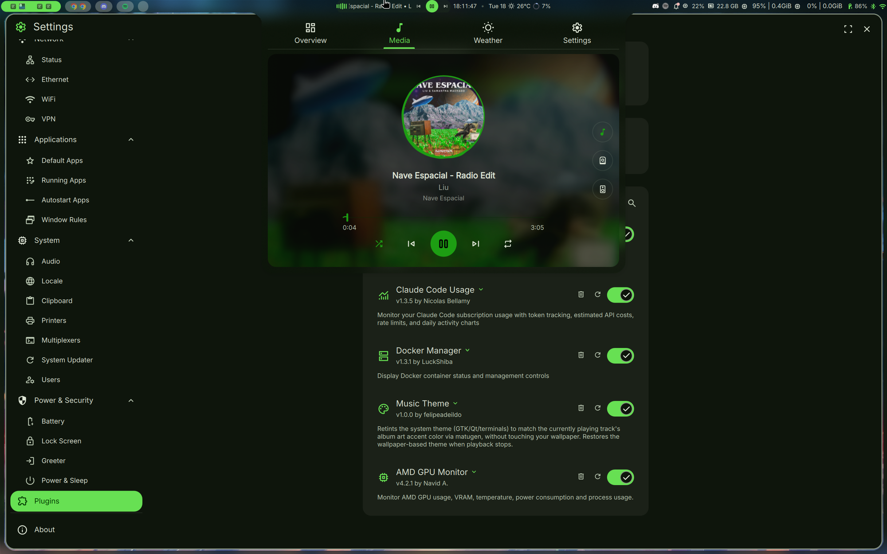
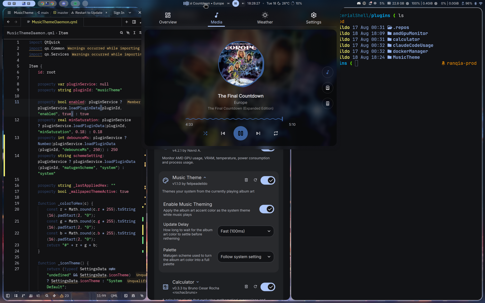
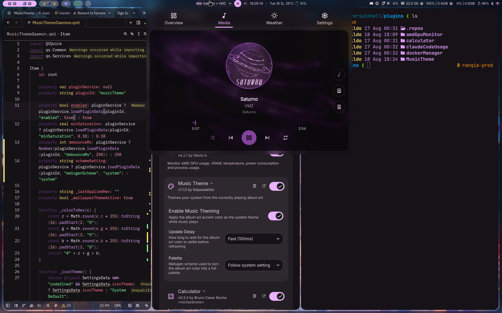
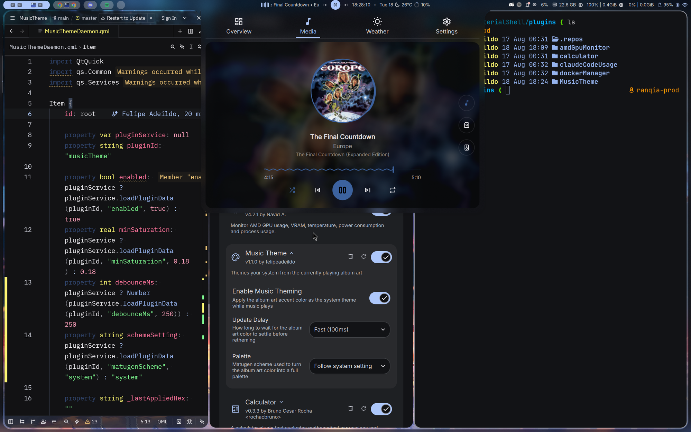

# Music Theme

A [DankMaterialShell](https://github.com/AvengeMedia/DankMaterialShell) plugin that themes your system (the shell, GTK, Qt, terminals, editors) from the album art of the track currently playing, without touching your wallpaper.

<div align="center">
  
</div>

<details>
<summary>More screenshots</summary>
<br>
<div align="center">
  
  
  <br>
  
</div>
</details>

## Features

- Reseeds the Dynamic theme from the accent DMS extracts from the playing track's album art
- Goes through DMS's own matugen pipeline, so the shell and every template (GTK, Qt, terminals, Neovim, VSCode, Firefox/Zen) follow the track
- Puts the album art color back when DMS regenerates the theme mid-track (wallpaper change, light/dark toggle, scheme change)
- Hands the theme back to DMS when playback stops, the player closes or the plugin is disabled
- Reads MPRIS and album art through DMS, with no `playerctl` or Python

## Requirements

- DMS >= 1.5.0 with matugen available. It is on unless you set `DMS_DISABLE_MATUGEN=1`.
- The Dynamic theme selected in DMS
- "Use album art accent" turned on in the DMS media player options, on DMS versions that have it
- Derived color set to "From wallpaper" on DMS builds that have that option
- A media player exposing MPRIS with album art (Spotify, browsers, mpv, etc.)

The plugin stays idle until all of these hold, and its settings page says which one is missing.

## Installation

```bash
git clone https://github.com/felipeadeildo/dms-music-theme.git \
  ~/.config/DankMaterialShell/plugins/MusicTheme
```

1. Open DMS Settings (Ctrl+,)
2. Navigate to Plugins tab
3. Click "Scan for Plugins"
4. Enable "Music Theme" with the toggle switch

## Configuration

- **Update Delay** sets how long the album art color has to settle before the theme changes.
- **Palette** picks the matugen scheme that turns the accent into a full palette.

## License

MIT
